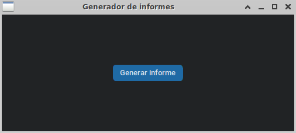

# GUI 4 LOLA
Repo containing the source of the GUI for LOLA platform **prepared to work only with our Jetson Xavier inside rober user**. However, changing the .desktop file and the launch.sh you could adapt it to different platforms and users.

# Installation

This guide assumes you already have a working ros workspace with [Lola 2](https://github.com/gramuah/lola2), [Logitech F710](https://github.com/husarion/logitech_f710_ros) and [Robot Upstart](https://roboticsbackend.com/make-ros-launch-start-on-boot-with-robot_upstart/) packages.

If you want to, you can directly use this [script](install_gui4lola.sh).

1. First clone this repository (it is a private repo, so we encourage you to use [ssh keys](https://docs.github.com/es/authentication/connecting-to-github-with-ssh) once you are authorized):

```shell
cd ~/
git clone git@github.com:gramuah/gui4lola.git
```

2. First install the necessary libraries **outside any conda environment**:

```shell
sudo apt install python3-pip
sudo apt-get install python3-tk
pip install python-vlc
pip install pillow
```

3. Copy the [LAUNCH_LOLA.desktop](LAUNCH_LOLA.desktop) into the desktop:
```shell
cp ~/gui4lola/LAUNCH_LOLA.desktop ~/Desktop
```

# Usage

Just double click on the application desktop icon :D

# Usage report generator

First of all we must run the report generation file in a terminal

``` sheel
cd gui4lola/
python3 report_generator.py
```



Once we have the program open, we must press the "Generar Informe" button and select the file we want to generate. The generated file will be saved in "gui4lola/Reports" and will be a html file.